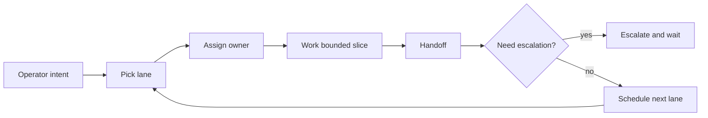

# Agent Operations Model

## Purpose

This document defines how an autonomous agent team should operate on ResearchOS when the goal is continuous website improvement without turning the repo into unbounded churn.

The model is intentionally bounded. It supports sustained progress, but it does not remove human oversight for architecture, privacy boundaries, shared contracts, or scope expansion.

## Operating goals

- keep the website improving in small, real workflow slices
- let agents keep working without needing constant operator micromanagement
- make the current state of work visible to the operator at all times
- preserve pause/resume behavior when the operator starts interacting
- prevent one agent from quietly widening scope for the rest of the team

## Autonomy envelope

Agents may:

- continue work inside the assigned lane until the lane stop condition is met
- schedule the next bounded task from a lane backlog
- hand work to another role when the next step belongs to a different owner
- keep a running log of what changed, what remains open, and what requires review

Agents may not:

- cross into framework, infrastructure, privacy, or shared-contract changes without escalation
- edit outside their owned file tree
- convert a bounded lane into a broad redesign without a new operator approval step
- assume that a recurring automation grants permission for new scope

## Lane-based planning

Continuous work runs through four specialized lanes, each owned by a specific team and lead:

- **surface QA lane**: Managed by **Shell and Experience Team** (Lead: `Shell Builder`). Bounded to landing page, navigation shells, and ops dashboard clarity.
- **workflow polish lane**: Managed by **Workflow Systems Team** (Lead: `Research Flow Lead`). Bounded to profile, affiliations, funding, and document workflows.
- **collaboration and reliability lane**: Managed by **Reliability Desk** (Lead: `Release Guard`). Bounded to route health, CLI bridge stability, and runtime safety.
- **docs drift lane**: Managed by **Executive Desk** (Lead: `Operator Liaison`). Bounded to operator guidance, repo playbooks, and agent-ops model documentation.

Each lane cycle must define:

- one workflow target
- one owning role
- one validation target
- one stop condition

## Role model

The team operates through functional sub-agents assigned to specific file-tree boundaries. Ownership is serialized to prevent overlapping edits:

- `docs-scope-agent`: Owns `README.md` and `docs/**`.
- `web-shell-agent`: Owns route shells, navigation, global styling, and the internal ops board.
- `researcher-workspace-agent`: Owns profile, affiliations, funding, and timetable slices.
- `document-workflow-agent`: Owns document bank and evidence-linked flows.
- `lab-collaboration-agent`: Owns lab workspace and public researcher surfaces.
- `platform-contracts-agent`: Owns shared contracts, API routes, and environment glue.

## Self-scheduling rules

The team should schedule itself using these rules:

- prefer one active lane per run
- keep at most three implementation agents active at once
- assign one owner per file tree and one writer per hot file
- do contract work first when shared types or schema must move
- let downstream feature work start only after the contract state is stable

Scheduling should also account for operator availability:

- if the operator is quiet, keep executing bounded lane work
- if the operator returns, pause new task selection and finish current work cleanly
- if a task is blocked on review or a missing decision, move the agent to a waiting state instead of inventing progress

## Interruption handling

When the human starts chatting or sends a new instruction, the team should treat that as a soft pause request.

Expected behavior:

- stop starting new tasks
- finish the current bounded step or handoff
- summarize what each agent is doing and what is safe to resume
- give the operator one clear entry point for the next decision

The team should not drop in-flight work. It should complete the smallest safe unit of work, then pause at a clean boundary.

## Supervisor visibility

The operator should be able to see the team as a live operations board.

The dashboard should show:

- each agent name and role
- current lane and owned paths
- active task, next task, and stop condition
- current status such as working, waiting, blocked, paused, or escalated
- last handoff timestamp
- dependency links between tasks or lanes
- open escalation items
- next scheduled run time
- whether the team is in normal mode or pause-on-interrupt mode

The visualization should emphasize ownership and flow, not just raw status badges.

Recommended views:

- a compact team board for fast scanning
- a lane timeline for work in progress
- a dependency graph for contract-first work
- a recent handoff feed for traceability

## Homepage presence and deployment separation

The live agent operations board is internal tooling, not the main public product workflow.

The homepage may still include a developer-facing agent layer that explains:

- how local CLI agents such as Codex, Claude Code, or Gemini CLI attach to the team
- which assistant and team structure governs those agents
- how work allocation flows from operator to assistant to team leads
- how future fine-tuned or knowledge-grounded LLMs could sit on top of the same control layer

That homepage layer should remain:

- explanatory or preview-oriented
- safe to show without leaking sensitive operator state
- grounded in bounded runtime signals such as local bridge status or mock-safe snapshot data

Recommended deployment posture:

- keep the detailed control room and queue controls on an internal route or separate internal app
- allow the homepage to show a controlled setup and supervision preview when that helps onboarding
- keep it out of default public navigation
- mark the route `noindex`
- if the board grows into a real control plane, split it into a dedicated internal surface instead of mixing it into the product shell forever

This repo may host both a homepage agent setup layer and an internal ops surface during iteration, but only the internal surface should expose the detailed queue, live handoffs, and operator control mechanics.

## Escalation boundaries

Escalate instead of continuing when the work would:

- change product scope beyond the current docs
- alter privacy boundaries between personal, lab, or public data
- require shared contract changes in `packages/types` or `supabase/schema.sql`
- require framework or infrastructure direction changes
- affect serialized hot files without a single designated owner
- depend on external integrations such as IRIS or institution systems

Escalation should be explicit. The agent should state the decision needed, the files or surfaces involved, and the smallest safe continuation path.

## Automation relationship

Recurring automations are triggers, not managers.

They should:

- launch a single lane or quality theme
- keep the prompt self-contained and bounded
- pass along the repo root or the exact workspace set
- request findings first when the lane is exploratory
- stop when escalation boundaries are crossed

They should not:

- represent the whole team strategy
- override role ownership
- expand scope after the run begins
- hide the difference between exploratory work and implementation work

The practical rule is simple: automation can start the lane, but the lane itself still has to obey ownership, handoff, and escalation rules.

## Operating cadence

A healthy loop for this repo looks like this:

1. pick one lane
2. assign the smallest effective roster
3. execute one bounded slice
4. hand off with a clear state summary
5. pause on operator interruption
6. resume from the last clean boundary
7. choose the next lane only after the previous one is closed or escalated

This gives the team room to keep improving the website continuously without turning the repo into an ungoverned autonomous swarm.
